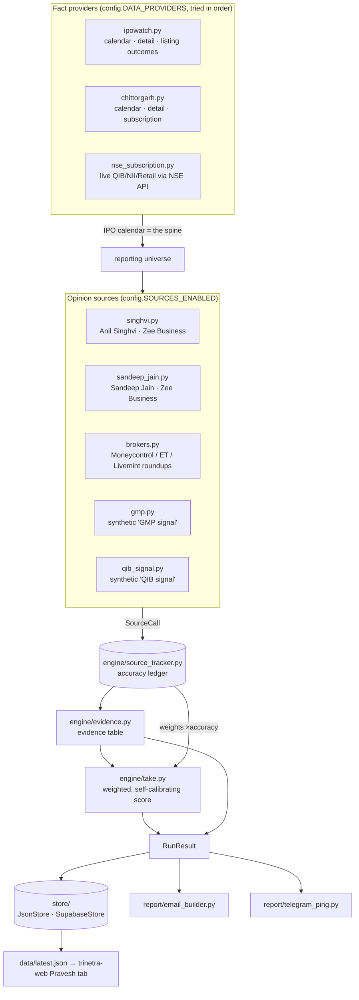

# Trinetra Pravesh — IPO intelligence engine

**Evidence first, not verdict first.** For every live IPO, Pravesh builds a table of named
sources — the named market experts (Anil Singhvi, Sandeep Jain), each brokerage that went on
record, plus two synthetic signals (GMP, QIB) — showing what each said *and how often that
source has actually been right*.
Only then does it give **My Take**: a scored, reasoned opinion that names the strongest
evidence for and against, and always ends with **"Final call is yours."**

Pravesh is a standalone Python service in the Trinetra family. It does not live inside the
Node backend (that handles live stock data). It shares exactly two things with Trinetra:
the same Telegram bot token/channel, and the visual language of the web tab.

```
09:00 & 15:00 IST, weekdays  →  scrape  →  evidence table  →  my take  →  email + telegram
                                                ↓                ↑
                                     data/*.json  →  trinetra-web "Pravesh" tab
                                     data/history/  ──────────┘  what moved since this morning
```

Twice a day, because subscription multiples and GMP move a lot between the open and
mid-afternoon — see **Two runs a day**.

---

## Architecture



Everything tunable — weights, thresholds, source lists, URLs, provider order, store
choice, market/exchange assumptions — lives in **`src/config.py`**. Adding a brokerage or
swapping a data source is one file plus one registry line, never a rewrite.

---

## Repo layout

```
pravesh-engine/
├── .github/workflows/pravesh-daily.yml
├── src/
│   ├── main.py                    orchestrator + --dry-run
│   ├── config.py                  ALL tunables
│   ├── models.py                  IPO · SourceCall · Evidence · Take · IPODelta · RunResult
│   ├── clock.py                   market-timezone helpers (IST by default)
│   ├── slots.py                   which of the day's runs this is, and how it is labelled
│   ├── sources/
│   │   ├── base.py                Source + DataProvider ABCs, HTTP, table/date parsing
│   │   ├── ipowatch.py            calendar spine · detail strip · listing outcomes
│   │   ├── chittorgarh.py         same roles (fallback — see "When scrapers break")
│   │   ├── nse_subscription.py    live QIB/NII/Retail/Total from NSE's own API
│   │   ├── search.py              discovery chain: Google News RSS · topic pages · DDG
│   │   ├── gmp.py                 GMP + synthetic "GMP signal"
│   │   ├── qib_signal.py          synthetic "QIB signal"
│   │   ├── expert.py              shared machinery for any named expert source
│   │   ├── singhvi.py             Anil Singhvi (Zee Business) — constants only
│   │   ├── sandeep_jain.py        Sandeep Jain (Zee Business) — constants only
│   │   └── brokers.py             named brokerages from roundups
│   ├── engine/
│   │   ├── evidence.py            per-IPO evidence table
│   │   ├── expert_feed.py         expert_calls + source_status for trinetra-backend
│   │   ├── take.py                self-calibrating score + reasoned paragraph
│   │   ├── delta.py               what moved since the earlier run of the same day
│   │   └── source_tracker.py      accuracy ledger + leaderboard
│   ├── store/
│   │   ├── base.py                Store ABC + merge rules + factory
│   │   ├── json_store.py          DEFAULT — data/*.json
│   │   └── supabase_store.py      drop-in upgrade
│   └── report/
│       ├── email_builder.py       inline-CSS HTML + Gmail SMTP
│       └── telegram_ping.py       ≤4096-char ping
├── data/
│   ├── verdicts.json              my-take history + listing outcomes
│   ├── source_calls.json          every source call + its outcome
│   ├── latest.json                the web contract
│   └── history/                   one payload per run: YYYY-MM-DD-<slot>.json, 90-day tail
└── requirements.txt
```

Four files are additions to the original spec, for reasons documented below:
`ipowatch.py` / `nse_subscription.py` (chittorgarh.com went client-side),
`search.py` (zeebiz.com and DuckDuckGo block this crawler, so discovery needed more than
one route) and `clock.py` (so the IST assumption lives in exactly one place). All four are
plain `Source` / `DataProvider` implementations wired through `config.py` — see
"When scrapers break".

`slots.py` and `engine/delta.py` came with the move to two runs a weekday: one owns the run's
identity, the other owns what changed since the earlier run. Both are config-driven — see
"Two runs a day".

---

## Setup

```bash
python -m venv .venv && source .venv/bin/activate
pip install -r requirements.txt
python -m src.main --dry-run      # writes out/pravesh_preview.html, prints the ping, sends nothing
python -m src.main                # the real thing
```

Useful flags: `--no-email`, `--no-telegram`, `--store json|supabase`, `--date YYYY-MM-DD`
(backfill), `--slot morning|afternoon|manual` (which of the day's runs this is — see
"Two runs a day"), `-v` (debug logging).

### Gmail app password

1. Enable 2-Step Verification on the sending Google account.
2. <https://myaccount.google.com/apppasswords> → create an app password ("Pravesh").
3. Use that 16-character string as `GMAIL_APP_PASSWORD` — never the account password.

### Secrets (Settings → Secrets and variables → Actions → Secrets)

| Secret | Required | What it is |
|---|---|---|
| `GMAIL_ADDRESS` | yes | Sending Gmail address |
| `GMAIL_APP_PASSWORD` | yes | 16-char app password from above (spaces are stripped, so paste it as Google shows it) |
| `RECIPIENT_EMAIL` | yes | Recipient(s) — one address, or many separated by commas, semicolons, spaces or newlines |
| `TELEGRAM_BOT_TOKEN` | yes | **Same token as the Trinetra stock bot** |
| `TELEGRAM_CHAT_ID` | yes | Same channel/chat id as Trinetra |
| `SUPABASE_URL` | only for Supabase store | Project URL |
| `SUPABASE_SERVICE_KEY` | only for Supabase store | Service role key |

Repository **variable** (not secret): `PRAVESH_STORE` = `json` (default) or `supabase`.

To add or change readers later, edit `RECIPIENT_EMAIL` alone — nothing in the code needs
touching. Every send logs which addresses it resolved, so the run log always shows where
the report went.
The workflow only commits `data/*.json` back when it is not `supabase`.

### Enabling the workflow

Push to `master`, open the **Actions** tab, enable workflows, then run **Pravesh Daily** via
`workflow_dispatch` once (tick *dry run* for a no-send rehearsal; the preview HTML is
uploaded as an artifact). `permissions: contents: write` is required so the JSON store can
commit results back. What triggers it from then on is the next section.

---

## Two runs a day — slots, and what moved

An open IPO is a moving target. QIB can go from 4x at the open to 12x by mid-afternoon and
GMP moves with it, so one report a day is a snapshot of the least informative moment. Pravesh
therefore runs **twice on a weekday**:

| Slot | IST | What it is |
|---|---|---|
| `morning` | 09:00 (window 09:00–10:30) | the day's first read |
| `afternoon` | 15:00 (window 15:00–16:00) | an **update** — what changed since the morning |
| `manual` | — | any hand-dispatched or local run; the default when nothing says otherwise |

Slot names, labels and their chronological order live in `config.RUN_SLOTS`. Adding a midday
slot is an edit there plus a window in the backend's config — no code change.

### What triggers a run

**Not GitHub's scheduler — there is no `schedule:` block any more.** It was
`cron: "30 3 * * 1-5"` (03:30 UTC = 09:00 IST) and it was removed on **2026-08-03**.

We first believed it never fired: checks on weekdays at 09:00, 09:30 and 11:20 IST found
nothing dispatched, and every run in the history was a manual one. That reading was wrong in
an instructive way. On 2026-08-03 the cron did fire — at **06:41 UTC, 3h12m late**, which is
12:11 IST, *after* every one of those checks. It was not skipping; it was arriving late enough
to look like skipping. Free-tier scheduled workflows are best-effort on shared infrastructure,
and "best-effort" turned out to mean hours of drift rather than silence.

That made keeping it as a harmless fallback untenable, because its nominal time is the **exact
start of the backend trigger's morning window** (09:00–10:30 IST). A schedule trigger carries
no inputs, so its runs fall back to the `morning` slot: an on-time cron would have put a second
morning report in the same inbox and the same Telegram channel as the backend's. Drift was the
only thing keeping them apart, and drift is not a design.

The trigger we control lives in **trinetra-backend** (`lib/praveshTrigger.js`): it checks the
IST clock every few minutes and, when it is inside a slot's window on a weekday and that slot
has not been dispatched today, calls

```
POST /repos/{owner}/pravesh-engine/actions/workflows/pravesh-daily.yml/dispatches
{ "ref": "master", "inputs": { "slot": "morning" | "afternoon" } }
```

It is a **window, not an instant**, because Render's free tier sleeps the instance overnight
and a keep-alive cannot wake a sleeping process — the first request that wakes it inside the
window fires the dispatch. An external uptime pinger hitting `/health` from ~08:45 IST is what
makes the morning run punctual; without one it happens whenever the instance first wakes inside
the window. See that repo's README for the env vars and `/pravesh/trigger-status`.

> **If you ever need a cron back as a fallback, do not restore the old one.** Put it well
> clear of both windows — `cron: "0 8 * * 1-5"` (08:00 UTC = 13:30 IST) sits between them with
> hours of headroom on each side, so even a long drift cannot land it on a backend dispatch.
> Expect it to arrive late, and expect its runs to be labelled `morning` regardless of when
> they land, since a schedule trigger cannot pass a slot.

### How a run knows which slot it is

`PRAVESH_SLOT` — set by the workflow from the dispatch input (`inputs.slot || 'morning'`, so a
schedule trigger still labels itself). Locally, `--slot morning|afternoon|manual`. An unknown
or missing value degrades to `manual`: a mislabelled report still goes out.

The slot and the IST timestamp appear in the Telegram header, the email subject and header
band, and `latest.json` — all three from one captured moment, so they cannot disagree:

```
Trinetra Pravesh · 03 Aug · 15:04 IST · afternoon update
```

### The "since this morning" line

Every run archives its full payload to `data/history/YYYY-MM-DD-<slot>.json` (Supabase: a
`run:<date>:<slot>` row in the latest table). The afternoon run diffs against the most recent
*earlier* slot of the same day and renders one line per IPO:

```
since this morning · now closing · QIB 4.20x → 11.80x · GMP +18.0% → +24.0%
```

Ordered most-material-first (status change → QIB → Total → GMP → NII → Retail) and capped at
four fragments; the full numbers are in the detail strip below it either way. The rules that
keep it honest:

* **No baseline, no delta.** First run of the day, first run after a deploy, an archive that
  never got committed — the line is omitted silently rather than invented. `latest.json` is
  the fallback baseline when it is from the same day and an earlier slot, which is what makes
  the first afternoon update after this shipped carry a real delta.
* **A number that vanished is not a fall.** A category with data this morning and none now is
  a scrape gap, so it is skipped, not reported as a move.
* **Movement below `config.DELTA` thresholds is not printed** — 0.05x and 0.5pp. Below those
  it is rounding noise, and printing it would manufacture a story.

The archive keeps a **90-day** tail (`config.HISTORY_STORE["retain_days"]`). Pruning happens in
`scripts/reconcile_data.py`, after the workflow has unioned this run's snapshots with the
branch's — pruning earlier would just be undone by the reset onto `origin`.

---

## The source accuracy ledger

Every call any source makes is written to `data/source_calls.json` keyed on
`(ipo_slug, source_name)`. When the IPO lists, each call is graded against the real
listing gain:

* apply-type call correct if listing gain **≥ +5 %**
* avoid-type call correct if listing gain **≤ +5 %**
* `NEUTRAL` / `NO_VIEW` are **excluded** — a non-call cannot be right or wrong
* a resolved call is frozen: a source cannot quietly rewrite its own history

Accuracy is shown all-time and over the last 15 resolved calls, **always with n**. Below
**n = 5** we print *"insufficient history"*, never a percentage — a 100 % from two calls is
noise dressed as signal. The leaderboard (top 5) sits in the email footer and the web tab.

My own take is held to the same standard: `verdicts.json` records every non-preliminary
call and grades it identically (`RISKY` is excluded — it is an explicit refusal to call).

### Self-calibration

Base weights: **QIB 30 · GMP 25 · total subscription 15 · Singhvi 7.5 · Sandeep Jain 7.5 ·
broker consensus 15**. Once a source has **n ≥ 10** resolved calls, its weight is multiplied
by `clamp(accuracy / 60 %, 0.5, 1.5)`. Absent sources are dropped and the rest renormalised,
so a dead scraper shifts emphasis instead of silently scoring zero.

**The named experts split one budget, they do not each get one.** `EXPERT_WEIGHT_BUDGET` is
**15** in total and Singhvi and Sandeep Jain hold 7.5 each — adding a second expert did not
increase how much personal opinion counts against the hard numbers, it divided the existing
allocation. An assertion in `config.py` fails at import if that ever stops being true. Each
expert calibrates **independently** once they clear n ≥ 10, so a good record lifts one
without lifting the other, and neither is pooled into the broker consensus (that would let
one person's record move two dials at once).

Modifiers: OFS > 75 % ⇒ −10 · SME ⇒ −10 and capped at RISKY unless the score ≥ 80 ·
no bidding data yet ⇒ PRELIMINARY. When *nothing* has landed — no bidding, no GMP, nobody
on record — Pravesh prints **"PRELIMINARY — no evidence yet"** and no score at all, because
a 0/100 there would read as AVOID, which would be a lie.

Bands: **≥70 🟢 APPLY · 50–69 🔵 LISTING GAINS ONLY · 35–49 🟡 RISKY · <35 🔴 AVOID**.

### The expert veto rule

If a named expert says **AVOID**, the score does **not** change. Instead a hard red banner is
attached to the IPO and rendered *above* My Take in every surface (email card, Telegram line,
web card). The reasoning behind the number stays honest; the warning is impossible to miss;
the decision stays yours.

Both experts carry the **same** veto — this is parity, not a hierarchy:

| Who said AVOID | Banner |
|---|---|
| Anil Singhvi | `⚠ Anil Singhvi says AVOID` |
| Sandeep Jain | `⚠ Sandeep Jain says AVOID` |
| **Both** | `⚠⚠ BOTH Anil Singhvi and Sandeep Jain say AVOID — two independent experts against this issue` |

Two independent experts against the same issue is a materially stronger warning than either
alone, so it collapses into **one** louder banner that names them together rather than two
near-identical lines the eye can slide past. The take paragraph says the same thing in
words. None of it touches the score — the banners live in `take.flags`, which every surface
already renders. Configured in `config.EXPERT_VETOES` / `config.BOTH_EXPERTS_VETO`.

### The named-expert feed (`expert_calls`) — what `trinetra-backend` ingests

`data/latest.json` carries a machine-readable feed of expert views so the backend stops
relying on manual entry. Built by `engine/expert_feed.py` from **this run's** calls only —
republishing the ledger's older calls would present last week's view as today's.

Capture rules, held deliberately tight:

| Field | Rule |
|---|---|
| `call` | **Verbatim as published.** Never normalised. `stanceNormalised` carries our reading in a *separate* field, so our vocabulary can never overwrite theirs. |
| `target` / `stop` | **Always `null`** for IPO views, and never derived — from each other, from GMP, or from the price band. An expert's IPO call is "subscribe" or "avoid", not a level. |
| `seenAt` | **Publication** time, or `null`. Never the scrape time. A two-month-old call scraped this morning is two months old; `capturedAt` holds the scrape time separately. |
| `url` | **Required.** A row without one is dropped here rather than shipped, and the drop is counted in `expert_coverage.droppedNoUrl`. |
| `NO_VIEW` | Never becomes a row — it is not a call. Counted in `expert_coverage.noView` so the absence stays visible, and split by `unreachable` so "could not check" is not counted as "had no view". |
| `symbol` | `null` by construction — an unlisted IPO has no ticker. Join on `ipoSlug`. |

**Blocked and silent are different states, and the payload keeps them apart.** An empty
`expert_calls` is ambiguous on its own, so it never travels alone: `source_status[].routes`
reports, per discovery route, how many times it was attempted, how many times it *answered*,
how many matches it produced, whether we gave up on it mid-run, and the real reason
(`HTTP 403` vs `responded 2/4, no matching item`). Read that block before concluding "no
calls today".

**Reachability is per ISSUE, not per source — read `expert_reachability`, not the
aggregate.** This is the one that actually decides an empty state, and getting it from
source-level counts is wrong in the normal case. Google News RSS rate-limits under repeated
querying, so it answers for some issues in a run and not others; the source then looks alive
in the aggregate while specific issues went genuinely unchecked. A measured run:

| Issue | Reachable | Checked | Correct empty state |
|---|---|---|---|
| `juniper-green-energy` | yes | 2/2 | no expert view |
| `mv-electrosystems` | yes | 1/2 | partly checked |
| `dhaval-packaging` | **no** | 0/2 | **could not check** |
| `fusion-klassroom` | **no** | 0/2 | **could not check** |
| `g-v-electricals` | **no** | 0/2 | **could not check** |

A source-level flag reads `blocked: false` there — both experts answered *for Juniper* — and
would render all five as "no expert view". Only one of the five is. `expert_reachability`
resolves it per issue: `reachable: false` means nothing answered about that issue and its
absence carries no information at all; `reachable: true` with
`expertsChecked < expertsTotal` is the partial case. `expert_coverage[].unreachable` is the
same fact rolled up per expert, as the subset of `noView` that was never actually checked.

**Which routes actually load** (measured 2026-08-03, from this machine):

| Route | State | Consequence |
|---|---|---|
| `zeebiz.com/search` | **HTTP 403** on every request, both experts | Never contributes. Dropped after 3 attempts per run. |
| DuckDuckGo HTML | **Connect timeout / captcha** | Never contributes. Dropped after 3 attempts per run. |
| **Google News RSS** | **Partly works** — server-rendered XML, not walled, but answered only 1–2 of 4 queries in a measured run (it rate-limits under repeated querying) | The only route carrying these sources at all. |

So: the anti-bot wall the backend hit is the same wall here, on the same two hosts — stated
plainly rather than hidden behind an empty result. What Pravesh has that the backend's path
does not is **Google News RSS**, which does answer and carries the headline, the publisher
and the `pubDate` that becomes `seenAt`.

Do not over-read that. Its limits are real:

* It is **intermittent**, not reliable — it rate-limits under repeated querying, so a run
  can query an issue and get nothing back for reasons that have nothing to do with whether
  the expert covered it. The `answered` vs `attempted` counts in `source_status` are there
  precisely so this is visible per run rather than inferred.
* It gives **headline + RSS summary only**. Its article links are Google wrappers that
  cannot be de-referenced server-side, so there is no article body to fall back on.
* A headline stating no explicit stance classifies as `NO_VIEW` rather than being guessed
  into a call.

Net effect: a modest trickle of attributable rows, not a firehose, and plenty of runs with
**zero** rows — `noView` equal to `queried`, every route's state spelled out. That is a real
signal about coverage, not a scraper quietly failing, and the two are distinguishable in the
payload without asking anyone.

A route dropped mid-run is flagged `dropped: true`, because its zeroes are a give-up rather
than a full sweep that found nothing — a distinction that would otherwise silently
understate coverage.

### Adding a third named expert

One identity in `config.SOURCE_*` + one entry in `EXPERT_SOURCES`, `EXPERT_SHORT_NAMES`,
`EXPERT_VETOES`, `EXPERT_WEIGHT_KEYS` and `WEIGHT_CALIBRATION_SOURCE`; a re-split of the
same `EXPERT_WEIGHT_BUDGET` across `BASE_WEIGHTS`; one constants-only scraper subclassing
`sources/expert.py`; one line in `sources.REGISTRY` and `SOURCES_ENABLED`. No engine change.

---

## Web contract — `data/latest.json`

Written every run (raw GitHub URL is the default feed for the web tab). The same payload is
archived to `data/history/<run_date>-<slot>.json`, so any past run reads with this exact shape.

```jsonc
{
  // 2 added expert_calls / expert_coverage / source_status; 3 added expert_reachability;
  // 4 added calendar_readable. All purely additive — every earlier key is unchanged and
  // still present, so an older consumer keeps working. The number moves so consumers can
  // feature-detect on it rather than on a key's presence.
  "schema_version": 4,
  "brand": { "name": "Trinetra Pravesh", "tagline": "…" },
  "generated_at": "2026-08-03T09:34:11+00:00",   // UTC ISO
  "generated_at_market": "03 Aug 2026, 15:04 IST",
  "generated_at_ist": "2026-08-03T15:04:00+05:30",  // same moment, ISO with the IST offset
  "run_date": "2026-08-03",
  "slot": "morning" | "afternoon" | "manual",
  "slot_label": "afternoon update",
  "slot_headline": "03 Aug · 15:04 IST · afternoon update",   // render this verbatim
  "counts": { "open": 3, "closing_tomorrow": 1, "upcoming": 2, "watch": 1 },

  "ipos": [{
    "name": "Acme Solar Industries Limited",
    "slug": "acme-solar-industries-limited",     // stable id across runs
    "segment": "MAINBOARD" | "SME",
    "status": "OPEN" | "UPCOMING" | "CLOSED" | "LISTED" | "UNKNOWN",
    "closing_tomorrow": true,
    "open_date": "2026-07-30", "close_date": "2026-08-01",
    "allotment_date": "2026-08-04", "listing_date": "2026-08-06",
    "price_band_low": 280, "price_band_high": 294, "price_band_label": "₹280–₹294",
    "lot_size": 51, "min_investment": 14994,
    "issue_size_cr": 1200, "fresh_issue_cr": 200, "ofs_cr": 1000, "ofs_pct": 83.3,
    "subscription": { "qib": 24.3, "nii": 11.2, "retail": 4.1, "employee": null,
                      "total": 13.8, "updated_at": "NSE · ACME" },
    "gmp": 52, "gmp_pct": 17.7, "gmp_source": "https://ipowatch.in/…",
    "detail_url": "https://…", "exchange": "BSE, NSE",

    // the product's heart. Row order is fixed: named experts (Anil Singhvi, then
    // Sandeep Jain), then brokerages A–Z, then the synthetic signals.
    "evidence": [{
      "source_name": "Anil Singhvi",
      "stance": "APPLY" | "SUBSCRIBE_LONG_TERM" | "APPLY_LISTING_GAINS"
              | "NEUTRAL" | "AVOID" | "NO_VIEW",
      "stance_label": "Subscribe",
      "rationale": "Zee Business: “…”",
      "accuracy_pct": 71.4,                        // null when n < 5
      "accuracy_n": 14,
      "accuracy_label": "71% (n=14)",              // or "insufficient history (n=2)"
      "url": "https://…",
      "is_synthetic": false                        // true for GMP/QIB signals
    }, {
      "source_name": "Sandeep Jain",               // same shape, same treatment, own n
      "stance": "AVOID", "stance_label": "Avoid",
      "rationale": "Zee Business: “…”",
      "accuracy_pct": null, "accuracy_n": 3,
      "accuracy_label": "insufficient history (n=3)",
      "url": "https://…", "is_synthetic": false
    }],

    "take": {
      "score": 61.8, "has_score": true,            // has_score=false ⇒ render "—", not 0
      "verdict_key": "LISTING_GAINS",
      "verdict_label": "LISTING GAINS ONLY", "verdict_emoji": "🔵",
      "verdict_color": "#1F5F9E",
      "paragraph": "The strongest argument … Final call is yours.",
      "one_liner": "LISTING GAINS ONLY (QIB 24.3x · GMP +18%)",
      "preliminary": false,
      // render above My Take. One entry per vetoing expert; when BOTH say AVOID this
      // collapses to the single stronger "⚠⚠ BOTH …" banner instead of two lines.
      "flags": ["⚠ Anil Singhvi says AVOID"],
      "components": [{ "key": "qib", "label": "QIB subscription", "raw_value": 24.3,
                       "normalised": 1.0, "base_weight": 30, "calibration_multiplier": 1.1,
                       "effective_weight": 33, "contribution": 28.4, "note": "…" }],
      "modifiers": ["-10 — 83% of the issue is offer-for-sale"],
      "strongest_for": "…", "strongest_against": "…",
      "created_at": "2026-07-31T03:30:11+00:00"
    },
    "flags": ["⚠ Anil Singhvi says AVOID"],        // mirror of take.flags

    "delta": {                                     // null on the day's first run, and
      "since_label": "since this morning",         //   null when nothing moved — never a
      "baseline_slot": "morning",                  //   fabricated "no change"
      "parts": ["now closing", "QIB 4.20x → 11.80x", "GMP +18.0% → +24.0%"],
      "is_new": false,                             // true ⇒ absent from the baseline run
      "line": "since this morning · now closing · QIB 4.20x → 11.80x · GMP +18.0% → +24.0%"
    }
  }],

  "leaderboard": [{ "source_name": "Anil Singhvi", "n_all": 14, "correct_all": 10,
                    "accuracy_all": 71.4, "n_recent": 14, "correct_recent": 10,
                    "accuracy_recent": 71.4, "is_synthetic": false }],
  "own_accuracy": { "n_all": 9, "accuracy_all": 66.7, "n_recent": 9,
                    "accuracy_recent": 66.7, "label": "67% (n=9)" },
  "history": [{ "ipo_slug": "…", "ipo_name": "…", "segment": "MAINBOARD",
                "verdict_key": "APPLY", "score": 74.2, "created_at": "…",
                "listing_date": "2026-07-10", "issue_price": 294,
                "listing_price": 331.5, "listing_gain_pct": 12.76,
                "resolved": true, "correct": true, "flags": [] }],
  "sources_ok": ["ipowatch", "nse_subscription", "gmp"],
  "sources_failed": ["singhvi: … "],               // non-empty ⇒ show a degraded notice

  // Whether the calendar could be read at all (schema_version ≥ 4). Treat as `true` when
  // absent. When it is false, `counts` is all zeros and `ipos` is empty for the SAME
  // reason a genuinely quiet day is — and the two mean opposite things. Render "could not
  // read the IPO calendar", NEVER "no IPOs today": issues may be open and closing right
  // now, unseen. On 2026-08-14 this shipped as "All quiet" with two mainboard issues open
  // and closing that day, which is what the flag exists to prevent.
  "calendar_readable": true,

  // ---- named-expert ingest surface (schema_version ≥ 2) -------------------------
  // One row per attributable expert view. NO_VIEW is never a row (it is not a call);
  // a row without a url is never emitted. See "The named-expert feed" below.
  "expert_calls": [{
    "symbol": null,                                // an unlisted IPO has no ticker
    "ipoSlug": "acme-solar-industries-limited",    // join on this, not on symbol
    "ipoName": "Acme Solar Industries Limited",
    "segment": "MAINBOARD",
    "expert": "Sandeep Jain",
    "call": "subscribe for listing gains",         // VERBATIM as published
    "stanceNormalised": "APPLY_LISTING_GAINS",     // our reading, kept separate
    "target": null, "stop": null,                  // always null for IPO views
    "rationale": "Zee Business: “…”",
    "url": "https://…",                            // required; no url ⇒ no row
    "seenAt": "2026-08-02T09:15:00+00:00",         // PUBLICATION time, or null
    "capturedAt": "2026-08-03T06:44:02+00:00",     // scrape time — never used as seenAt
    "source": "zeebiz.com",
    "listingDate": "2026-08-06"
  }],
  // What each expert was asked and what came back — so an empty `expert_calls` can be
  // read correctly instead of as "he had nothing to say". `unreachable` is the SUBSET of
  // `noView` where nothing answered at all: those are "could not check", not "no view".
  "expert_coverage": [{ "expert": "Sandeep Jain", "queried": 13, "calls": 0,
                        "noView": 13, "unreachable": 11, "droppedNoUrl": 0 }],

  // Per-ISSUE discovery state (schema_version ≥ 3). THE basis for an empty state.
  // `reachable: false` ⇒ nothing could be checked; absence means nothing. Render
  // "could not check", never "no expert view".
  // `reachable: true` + expertsChecked < expertsTotal ⇒ partly checked.
  "expert_reachability": [{
    "ipoSlug": "acme-solar-industries-limited",   // `ipo_slug` carries the same value
    "ipo_slug": "acme-solar-industries-limited",
    "ipoName": "Acme Solar Industries Limited",
    "reachable": true,                            // true if ANY expert could be checked
    "expertsChecked": 1, "expertsTotal": 2,       // the partial case, which is the common one
    "routes": [{ "expert": "Anil Singhvi", "reachable": true, "via": "Google News RSS",
                 "answeredRoutes": ["Google News RSS"], "quietRoutes": ["zeebiz search"] }]
  }],
  // Per source: did it work, and if not WHY. "HTTP 403" and "no matching item" are
  // different states and this block is the only place that keeps them apart.
  "source_status": [{
    "source": "sandeep_jain", "ok": true,
    "reason": "zeebiz search: HTTP 403 …; Google News RSS: responded 1/4, no matching item …",
    "routes": [{ "route": "zeebiz search", "attempted": 3, "answered": 0, "hits": 0,
                 "dropped": true, "reason": "HTTP 403 — route dropped after 3 in a row" }]
  }],
  "disclaimer": "Informational only. Not investment advice. …"
}
```

Consumers must treat every scalar as nullable, and must show `accuracy_label` verbatim
rather than recomputing a percentage. Same for `delta`: render `line` (or `parts`) as given —
a missing `delta` means *we have nothing to compare against*, which is not the same as
*nothing changed*, and must never be rendered as "no change".

---

## JSON ↔ Supabase

Default is `JsonStore` (files in `data/`, committed back by the workflow — zero infra,
fully diffable, and the raw GitHub URL is the web feed).

Switch with **one line**: `PRAVESH_STORE=supabase` (env or repo variable), or edit
`STORE_BACKEND` in `config.py`. Set `SUPABASE_URL` + `SUPABASE_SERVICE_KEY`. If the client
or credentials are missing, the engine logs the error and falls back to JSON rather than
losing a run. Table names are configurable in `config.SUPABASE`.

```sql
create table pravesh_source_calls (
  ipo_slug text not null, source_name text not null,
  ipo_name text, stance text, rationale text, url text,
  captured_at timestamptz, segment text, is_synthetic boolean default false,
  resolved boolean default false, correct boolean,
  listing_gain_pct double precision, resolved_at timestamptz,
  primary key (ipo_slug, source_name)
);

create table pravesh_verdicts (
  ipo_slug text primary key, ipo_name text, segment text,
  verdict_key text, score double precision, created_at timestamptz,
  listing_date date, issue_price double precision, listing_price double precision,
  listing_gain_pct double precision, resolved boolean default false,
  correct boolean, flags jsonb default '[]'::jsonb
);

create table pravesh_latest (
  key text primary key, payload jsonb not null, updated_at timestamptz
);
```

`pravesh_latest` holds the current snapshot under `key = 'current'` and every archived run
under `key = 'run:<date>:<slot>'`. Pruning only ever touches the `run:` keys.

---

## When scrapers break

Every scraper isolates its CSS selectors and column-header vocabulary in a `SELECTORS` /
`HEADER_KEYS` / `DETAIL_KEYS` block at the top of the file. Open the page, compare the
column headings, add the new wording. Nothing below those blocks should need editing.

| Symptom in the log | File to patch |
|---|---|
| `ipowatch: calendar table empty` | `sources/ipowatch.py` → `SELECTORS`, `HEADER_KEYS` |
| `ipowatch: detail page unparsed` | `sources/ipowatch.py` → `DETAIL_KEYS` |
| `chittorgarh: no rows for mainboard` | `sources/chittorgarh.py` → `SELECTORS`, `HEADER_KEYS` |
| `nse: current-issue feed empty` | `sources/nse_subscription.py` → `ENDPOINTS`, `CATEGORY_KEYS` |
| `gmp: … returned no rows` | `sources/gmp.py` → `SELECTORS`, `GMP_HEADER_KEYS` |
| `singhvi: every discovery route … returned nothing` | `sources/singhvi.py` → `SELECTORS`, `QUERY_TEMPLATES`; `sources/search.py` |
| `sandeep_jain: every discovery route … returned nothing` | `sources/sandeep_jain.py` → `SELECTORS`, `QUERY_TEMPLATES`; `sources/search.py` |
| `brokers: no roundup article reachable` | `sources/brokers.py` → `SELECTORS`, `ALLOWED_DOMAINS`, `FIRM_PATTERN`; `sources/search.py` |

**Known gaps, stated plainly** (verified 2026-07-31, all degrade to "not published yet"
rather than to a guess):

* **BSE SME bidding data.** NSE's API covers mainboard and NSE Emerge; no server-rendered
  source for BSE SME subscription was found. Those issues stay `PRELIMINARY` until they
  close, scored on GMP and published views alone.
* **Expert article bodies.** zeebiz.com returns 403 to this crawler, so both Singhvi's and
  Sandeep Jain's stances are classified from the headline plus the news summary.
  Hindi-language headlines classify as `NO_VIEW` rather than being machine-translated into
  a call. Sandeep Jain anchors on the **full** name — "Jain" alone is far too common a
  surname to attribute a call on, and a near-miss costs a `NO_VIEW`, which is the safe
  failure.
* **Google News links** are wrappers that cannot be de-referenced server-side; they are
  used for headline evidence, never for full-text extraction. They are still a valid `url`
  in `expert_calls` — they resolve to the publisher in a browser, so the call stays
  attributable, which is the bar for shipping a row.
* **zeebiz.com and DuckDuckGo are hard-blocked** (403 and captcha respectively) and
  contribute nothing to either expert. This is reported per route in `source_status`, never
  smoothed into a plain empty result.

**A whole site going client-side is not a code change — it is a config change.** As of
2026-07-31, `chittorgarh.com`'s report pages became a client-rendered Next.js app that
returns HTTP 200 with no table in the HTML. `config.DATA_PROVIDERS` was reordered so
`ipowatch` leads the calendar and NSE's own API leads subscription; `chittorgarh.py` stays
in the chain and takes over again the moment it returns rows. Providers are tried in order
until one yields actual rows — a 200 with an empty table counts as a failure, which is what
stops a silent JS rewrite from emptying the report.

**Silence always means breakage, never "nothing happened":** zero relevant IPOs still sends
a one-line *all quiet* email and ping, every degraded source is named in the footer, and
the workflow's `if: failure()` job emails a plain-text failure notice with the run URL.

---

## Honesty rules (do not "improve" these away)

1. The evidence table comes first; My Take is visually separate and always ends with
   **"Final call is yours."**
2. Accuracy is always shown with `n`; under n = 5 it reads *insufficient history*.
3. `NO_VIEW` is first-class and never penalised — neither expert covers every SME issue,
   and pretending otherwise would fabricate a signal.
4. GMP is labelled indicative and unofficial everywhere it appears.
5. An expert veto warns without secretly moving the number, and no expert outranks another
   — both get the same banner, and both AVOIDs together get a louder one.
6. Named experts split a fixed weight budget rather than each adding one, so the panel can
   grow without the engine becoming a channel for personal opinion over the hard numbers.
7. No evidence ⇒ no score, not a zero.
8. No earlier snapshot ⇒ no "since this morning" line. A delta is a measurement against a
   real prior run or it does not appear, and a number that vanished from a source is a scrape
   gap, never reported as a fall.

*Informational only. Not investment advice.*
